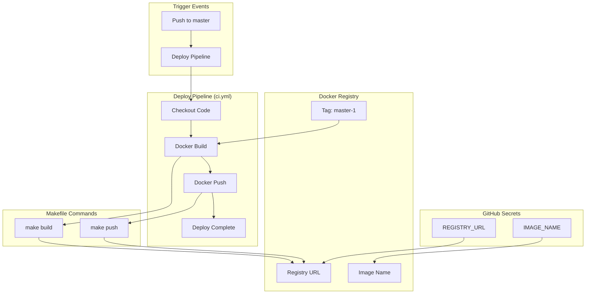
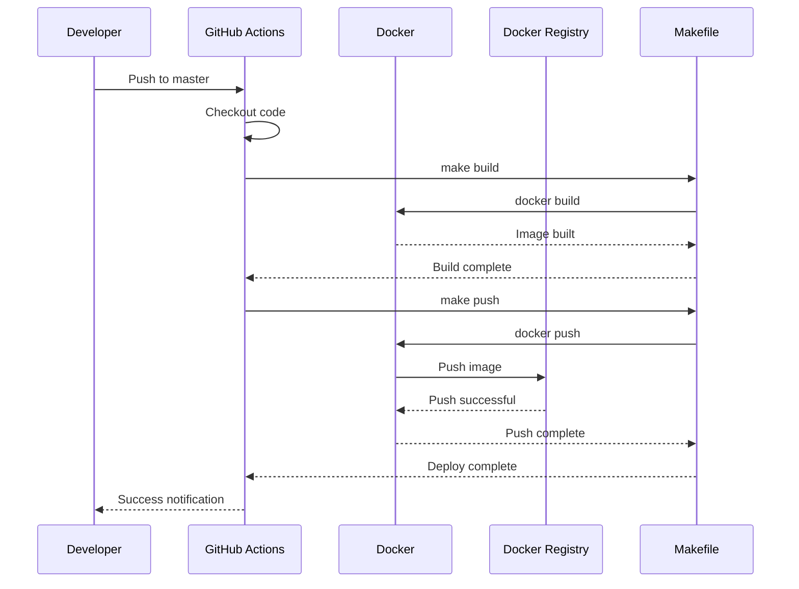

# GitHub Actions Workflows Architecture

## Текущая архитектура

## Поток выполнения

### 1. Deploy Pipeline (ci.yml)

## Ключевые компоненты

### Docker-based деплой

- **Контейнеризация**: Использование Docker для изоляции приложения
- **Registry**: Централизованное хранение образов
- **Версионирование**: Тегирование образов для отслеживания версий
- **Стандартизация**: Единый подход к сборке и деплою

### Makefile интеграция

- **Унификация команд**: Стандартизированные команды сборки и деплоя
- **Переменные окружения**: Гибкая настройка через переменные
- **Локальная разработка**: Возможность запуска команд локально
- **CI/CD совместимость**: Интеграция с GitHub Actions

### GitHub Secrets

- **Безопасность**: Хранение чувствительных данных в зашифрованном виде
- **Конфигурация**: Настройка registry и имен образов
- **Доступ**: Контролируемый доступ к секретам

## Преимущества текущей архитектуры

### Простота

- 🎯 **Фокус**: Единая цель - деплой frontend приложения
- 📝 **Понятность**: Минимальная конфигурация, легко понять
- 🔧 **Поддержка**: Простота в обслуживании и отладке

### Надежность

- 🐳 **Docker**: Изоляция и консистентность окружения
- 📦 **Registry**: Централизованное управление образами
- 🔄 **Автоматизация**: Полностью автоматический процесс

### Эффективность

- ⚡ **Быстрота**: Минимальное время выполнения
- 💾 **Ресурсы**: Оптимальное использование ресурсов GitHub Actions
- 🎯 **Целесообразность**: Выполнение только необходимых задач

### Масштабируемость

- 📈 **Расширяемость**: Легко добавить новые шаги
- 🔧 **Гибкость**: Возможность настройки под разные окружения
- 🏗️ **Стандартизация**: Использование проверенных практик
